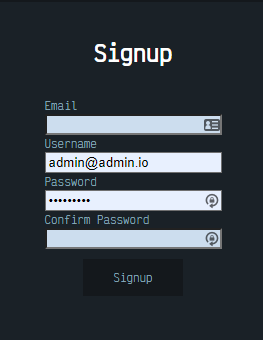
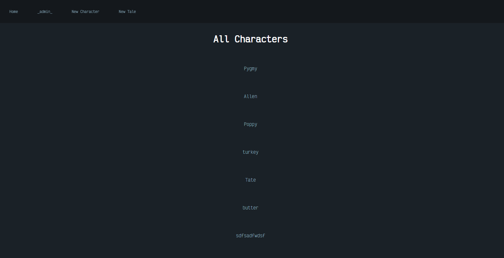
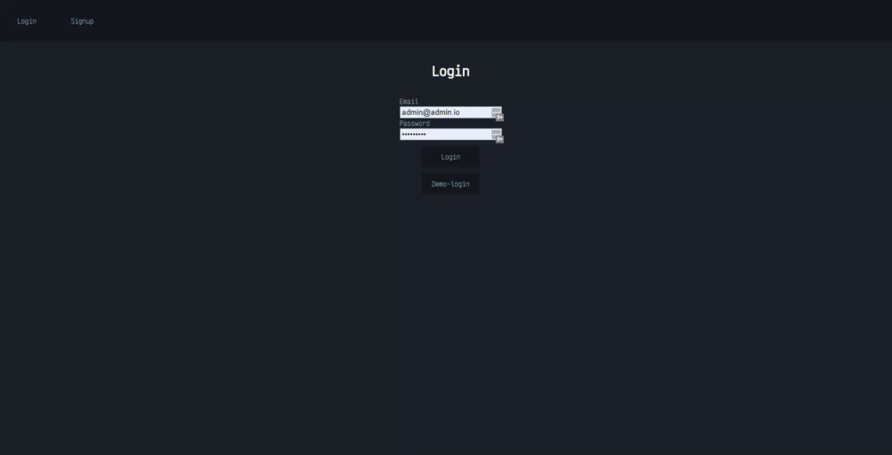

World Builder *by [Damien Darko](https://damiendarko.com/)*
---
World Builder is an app to make creating worlds of all kinds much easier. It brings together the creation of stories and characters into one place. Whether your intention is to create a storyline for a game, a book or a comic, World Builder aims to be the one-stop shop for such things!

Database Schema:
---
Users, Tales, Characters

Tools/Packages Used:
---
Node, Axios, Mongoose, Express, MongoDB, React, Redux

Screenshots:
---

Installation Setup Instructions
---
1. `cd` into a directory you will be cloning the repo into.
2. Clone repo `git clone https://github.com/djangothesolarboy/world-builder_mongodb_fullstack.git`.
3. Follow instructions for either backend or frontend.

Backend Installation Instructions
---
1. Use `cd backend` to change directory to the backend. 
2. Use `npm install` to install dependencies.
3. Use `npm start` to start server.

Frontend Installation Instructions
---
1. Use `cd frontend` to change directory to the frontend. 
2. Use `npm install` to install dependencies.
3. Use `npm start` to start client.